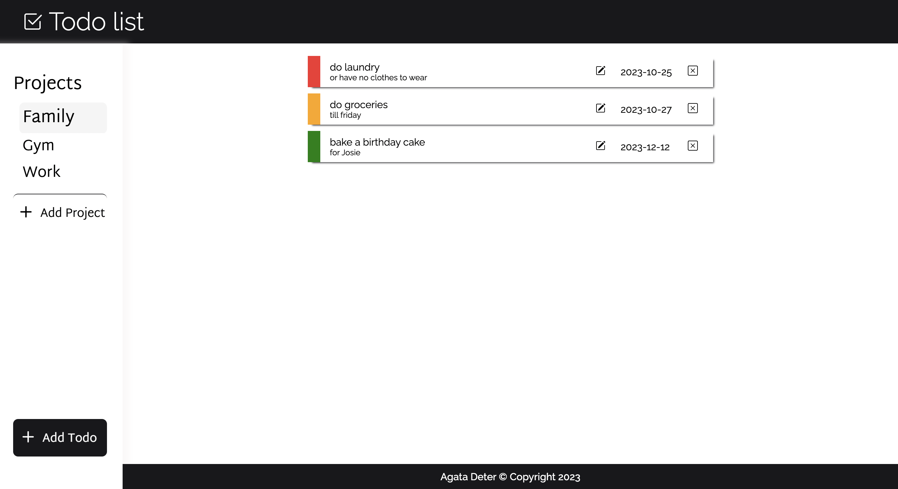

# Todo-list

## Table of Contents
* [General Info](#general-information)
* [Technologies](#technologies)
* [Screenshots](#screenshots)
* [Link to game](#link-to-game)
* [Setup](#setup)
* [Usage](#usage)
* [Icons](#icons)

## General information
Project is one of the task from [The Odin Project](https://www.theodinproject.com/lessons/node-path-javascript-todo-list) .

The main task was practicing modules in JS(ES6), npm, webpack and DOM manipulation. Also I used here LocalStorage for storing todos and made sure to use responisive design.

## Technologies
* CSS3
* HTML5
* JavaScript
* Webpack
* npm
* LocalStorage

## Screenshots

## Link to game

## Setup

1. Fork repository 

2. Clone reposiory
   `git clone https://github.com/YOUR-USERNAME/YOUR-REPOSITORY`

3. Install npm install webpack webpack-cli --save-dev

4. npm run watch

## Usage

The websites has 'default' projects that user can use to assign to them todos when he first time opens the app.

User can:
1. add/remove projects
2. add/edit/remove todos to each project
3. when clicked on todo, user can hide/udhide the description of todo.

## Icons

Icons where downloaded from Bootstrap.

